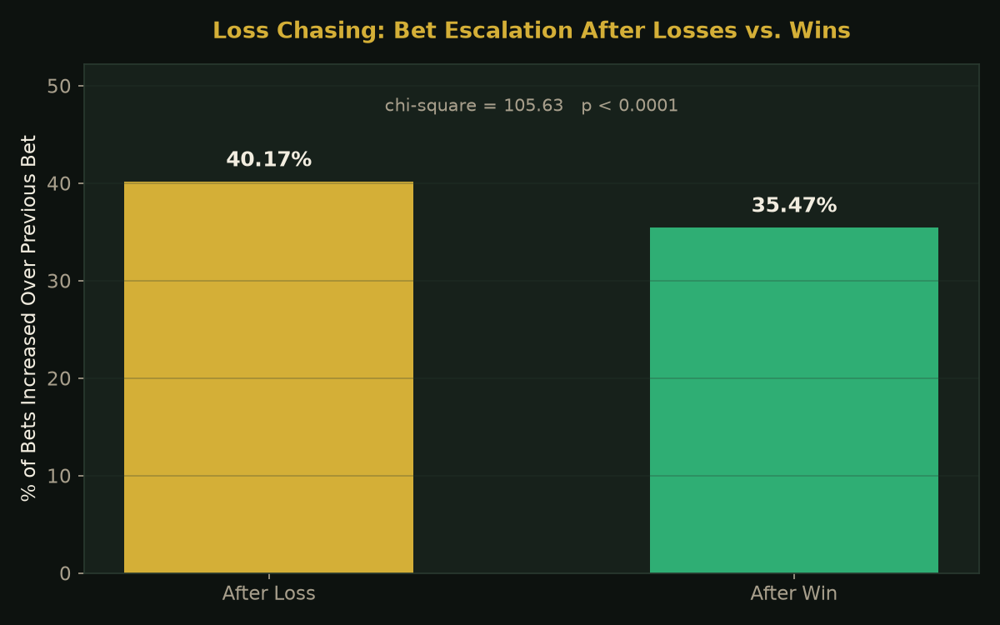
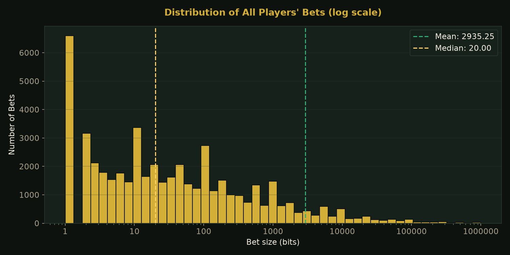
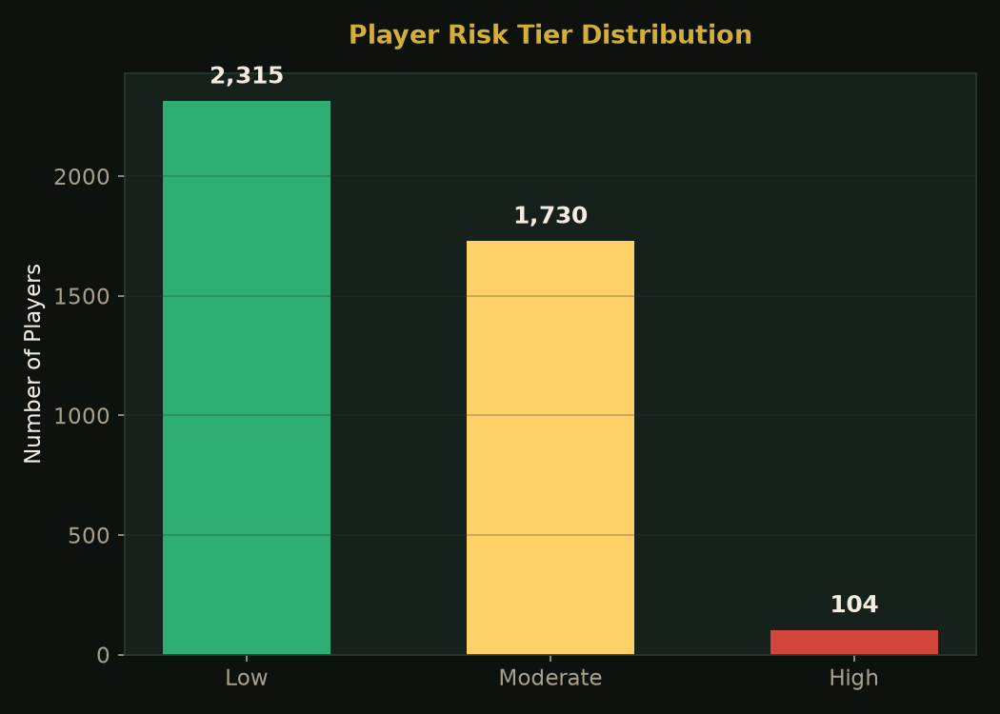
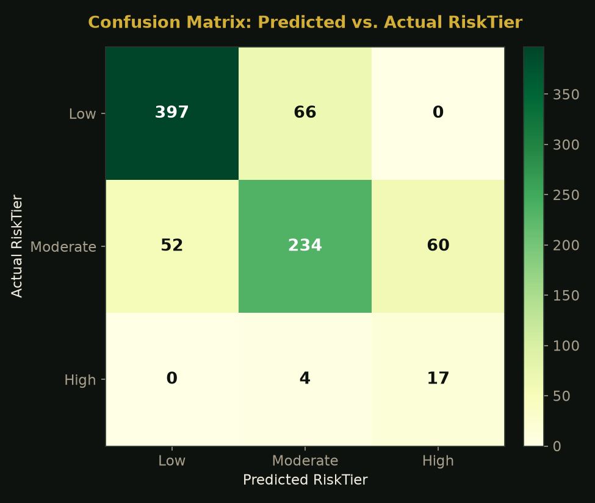

# Poker AI Coach with Addiction Screening

Resume: <https://jorgemaldol.github.io/PokerAI_at_risk_detection/docs/Resume_Jorge_Maldonado.pdf>

This project combines a poker learning app with machine learning to study risky gambling behavior.

We focused mainly on **loss-chasing**, which is when someone keeps betting or increases their bets after losing money.

Using real gambling data, we looked for patterns in how people bet and trained an XGBoost model to group players into Low, Moderate, or High risk levels.

We also built a poker app where users can play Hold'em against a computer or another player and get feedback on their decisions.

This project was created as part of the **AI4ALL Ignite Accelerator**.

## Problem Statement

Online gambling makes it very easy to keep playing after losing money.

One behavior we wanted to study was **loss-chasing**. This is when a player tries to make up for a loss by continuing to gamble or increasing their next bet.

Our main question was:

**Can we use a player's betting behavior to find patterns that may be connected to risky gambling?**

To explore this, we analyzed real gambling data and looked at things like bet size, wins and losses, how often someone played, and whether they increased their bets after losing.

We then trained a machine learning model to see if these behaviors could be used to group players into different risk levels.

The goal is not to diagnose gambling addiction. The risk levels in this project are only meant to identify behavioral patterns that may be worth paying attention to.

## Key Results

We created a dataset containing **4,149 players**:

- **2,315** Low risk
- **1,730** Moderate risk
- **104** High risk

We then trained an **XGBoost model** to predict these three risk levels.

Using 5-fold cross-validation, the model had:

- **77.6% average accuracy**
- **0.622 average Macro F1 score**

We also tested the final model on **830 players that were not used for training**.

On this test set, the model had:

- **78% overall accuracy**
- **81% recall for High-risk players**
- **22% precision for High-risk players**
- **0.35 F1 score for High-risk players**

### Model Results

| Risk Level | Precision | Recall | F1 Score |
|---|---:|---:|---:|
| Low | 0.88 | 0.86 | 0.87 |
| Moderate | 0.77 | 0.68 | 0.72 |
| High | 0.22 | 0.81 | 0.35 |

One result we paid close attention to was the **81% recall for the High-risk group**.

In simple terms, the model found most of the players that our system labeled High risk.

However, the **22% precision** shows that the model also had a lot of false alarms. Some players were predicted as High risk even though they were actually in another risk group.

For our project, we cared more about catching possible High-risk behavior than avoiding every false alarm. However, this is still an important weakness of the model.

There were also only **21 High-risk players in the final test set**, so more data would be needed before making strong conclusions.

## Data Visualizations

### 1. Loss-Chasing Behavior



**What this shows:**  
This graph compares how players changed their bets after winning and losing. We used this analysis to look for loss-chasing behavior, which was one of the main ideas behind our project.

### 2. Bet Size Distribution



**What this shows:**  
This graph shows the range of bet sizes in the dataset. Most bets are smaller, while a smaller number of bets are much larger. Looking at bet size helped us understand how differently players gamble.

### 3. Player Risk Levels



**What this shows:**  
There are far fewer High-risk players than Low and Moderate-risk players. This imbalance was important because a machine learning model could become biased toward the larger groups.

Because of this, we used SMOTE on our training data to help balance the groups.

### 4. Confusion Matrix



**What this shows:**  
The confusion matrix shows where the model made correct and incorrect predictions.

It helped us see that the model was able to find many of the High-risk examples, but it also incorrectly predicted some Moderate-risk players as High risk.

## Methodologies

We started by exploring the **Bustabit gambling dataset** using Python, pandas, and Jupyter Notebook.

The original data contains individual bets, so we grouped those bets by player.

This allowed us to create features that describe each player's overall behavior.

Some of the features we looked at included:

- Average bet
- Maximum bet
- Bet volatility
- Number of sessions
- Win rate
- Total profit
- Loss-chasing behavior

### Creating the Risk Levels

The Bustabit dataset does not tell us whether someone actually has a gambling addiction.

Because of this, we created our own **behavioral risk levels** based on patterns we could measure in the data.

We looked at signals such as:

- Loss-chasing
- How much someone's bet sizes changed
- How often they played

Players were then grouped into:

- Low risk
- Moderate risk
- High risk

These groups are not medical diagnoses. They are labels we created so we could study whether machine learning could recognize these behavioral patterns.

### Preparing the Data

We split the player data into a training set and a test set.

The training set contained **3,319 players**, while the test set contained **830 players**.

One problem was that we only had a small number of High-risk players.

The training data originally contained:

- 1,852 Low-risk players
- 1,384 Moderate-risk players
- 83 High-risk players

To help with this imbalance, we used **SMOTE**.

SMOTE creates new training examples based on the smaller group. We only used it on the training data so that the model would not see information from the test set.

### Training the Model

We chose **XGBoost** for our machine learning model.

XGBoost works well with data organized into features like bet size, win rate, profit, and player activity.

Instead of looking at only one behavior, the model can learn from several behaviors at the same time.

The goal was to predict whether a player belonged to the Low, Moderate, or High risk group.

### Testing the Model

We used **5-fold cross-validation** to make sure our results did not depend on only one train/test split.

The model was trained and tested several times using different parts of the training data.

The results were:

| Fold | Accuracy | Macro F1 |
|---|---:|---:|
| 1 | 79% | 0.63 |
| 2 | 79% | 0.65 |
| 3 | 75% | 0.60 |
| 4 | 79% | 0.62 |
| 5 | 76% | 0.61 |

The average accuracy was **77.6%**.

Finally, we tested the model on the separate test set of 830 players.

We looked at accuracy, precision, recall, F1 score, and the confusion matrix to understand how well the model performed.

## Poker App

Along with the data analysis, we built a playable poker app using **Streamlit**.

The app allows users to:

- Play heads-up Hold'em against a computer
- Play against another person
- Turn on a Learning Coach
- Get feedback on poker decisions

We also built a separate **FastAPI backend** for a GTO poker trainer.

The GTO trainer can give players poker situations and compare their decisions with poker solver strategies.

Right now, the GTO trainer and Streamlit poker app are separate. Connecting them is one of the next steps for the project.

## Data Sources

The main data used in this project is the **Bustabit gambling dataset**.

It contains information such as:

- Player username
- Bet amount
- Cash-out amount
- Profit or loss
- Game result
- Date played

The original dataset is stored in:

`Data/bustabit.csv`

After analyzing the data and creating features for each player, the processed data is stored in:

`Data/player_stats.csv`

This player-level data is what we used to train the XGBoost model.

## Technologies Used

- Python
- pandas
- NumPy
- Matplotlib
- SciPy
- scikit-learn
- XGBoost
- imbalanced-learn / SMOTE
- Jupyter Notebook
- Streamlit
- FastAPI
- SQLite
- PioSOLVER
- Gemini / Google Vertex AI
- Git
- GitHub
- pytest

## Authors

### Jorge Maldonado

**Role:** Machine Learning & Backend, Data Visualization  
**Focus:** Behavioral Risk Screening  
**GitHub:** [JorgeMaldoL](https://github.com/JorgeMaldoL)  
**LinkedIn:** [jorge-maldonado-494640245](https://www.linkedin.com/in/jorge-maldonado-494640245)

### Alex Shi

**Role:** Backend  
**GitHub:** [althexshi](https://github.com/althexshi)  
**LinkedIn:** [alex-shi-ba67a9195](https://www.linkedin.com/in/alex-shi-ba67a9195)

### Delight Oti

**Role:** Game & Front End  
**GitHub:** [DelightOti](https://github.com/DelightOti)

### Arnav Nagre

**Role:** Data Visualization & Machine Learning  
**GitHub:** [arna1015](https://github.com/arna1015)

### Ryan Nugraha

**Role:** Design & Front End


## Project Structure

| Path | What it contains |
|---|---|
| `notebooks/` | Data analysis and machine learning |
| `Data/` | Original and processed datasets |
| `models/` | Trained XGBoost model |
| `streamlit/` | Playable poker app |
| `src/poker_coach/api/` | GTO trainer backend |
| `tests/` | Project tests |
| `docs/` | Portfolio website |

## How to Setup

### Clone the project

```bash
git clone https://github.com/JorgeMaldoL/PokerAI_at_risk_detection.git
cd PokerAI_at_risk_detection
```

### Create a virtual environment

**Windows:**

```bash
python -m venv venv
venv\Scripts\activate
```

**Mac/Linux:**

```bash
python3 -m venv venv
source venv/bin/activate
```

### Install everything

```bash
pip install -e ".[dev]"
```

## Running the Poker App

Run:

```bash
python -m streamlit run streamlit/app.py
```

This starts the poker app and allows you to play against the computer.

### Multiplayer

For multiplayer, open another terminal and run:

```bash
cd streamlit
python -m uvicorn backend:app --reload --port 8000
```

Then open the Streamlit app in two browser windows. One player can create a room and the other can join.

## Running the GTO Trainer

Run:

```bash
uvicorn poker_coach.api.main:app --reload
```

Before using it, load the sample poker scenarios:

```bash
python -m poker_coach.ingest Data/sample_scenarios.json
```

The GTO trainer is currently separate from the Streamlit app.

## Running the Notebooks

Run:

```bash
jupyter lab
```

The main machine learning notebook is:

`notebooks/05_training_and_testing.ipynb`

The other notebooks contain our data exploration, loss-chasing analysis, feature engineering, and other gambling behavior analysis.

## Running Tests

```bash
pytest
```

## Current Status

- Poker app: **Playable**
- Vs Computer: **Complete**
- Multiplayer: **Complete**
- Gambling data analysis: **Complete**
- XGBoost risk model: **Trained and tested**
- GTO backend: **Built and tested**
- GTO connection to Streamlit: **Not connected yet**
- Gemini coaching: **Built but not connected to the API yet**

## Limitations

There are some important limits to this project.

Most importantly, the Bustabit dataset does not tell us whether someone actually has a gambling addiction.

We created the Low, Moderate, and High risk levels ourselves using behaviors we could measure in the data. This means the model learns to predict **our behavioral risk labels**, not a real medical diagnosis.

We also had very few High-risk players compared with the other groups. Only **21 High-risk players** were in the final test set.

The model also had low precision for the High-risk group, meaning it produced many false alarms.

Because of this, the model should only be viewed as an **experimental screening model**.

It should not be used to diagnose gambling addiction.

## What's Next

The next major step is connecting the GTO trainer to the Streamlit poker app.

We also want to connect the risk model to gameplay data from the poker app.

That would allow us to study behaviors such as:

- Increasing bets after losses
- Changes in bet size
- Long playing sessions
- Decision times
- Changes in behavior over time

The long-term goal is to combine poker education with tools that can help recognize potentially risky gambling behavior.